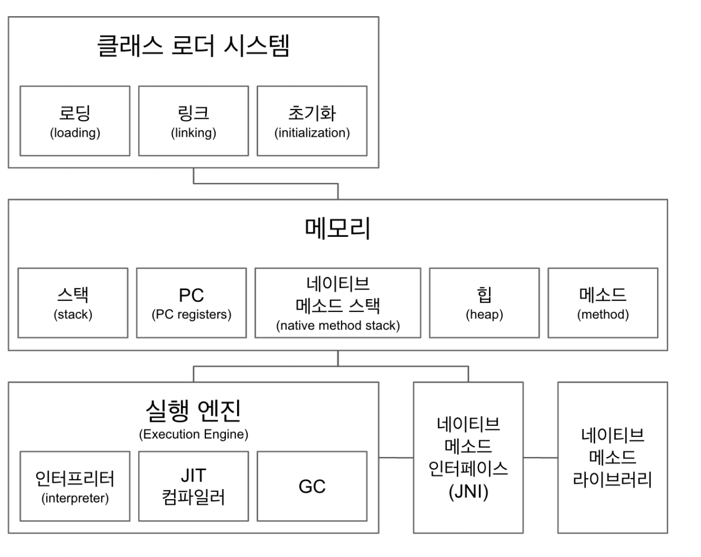
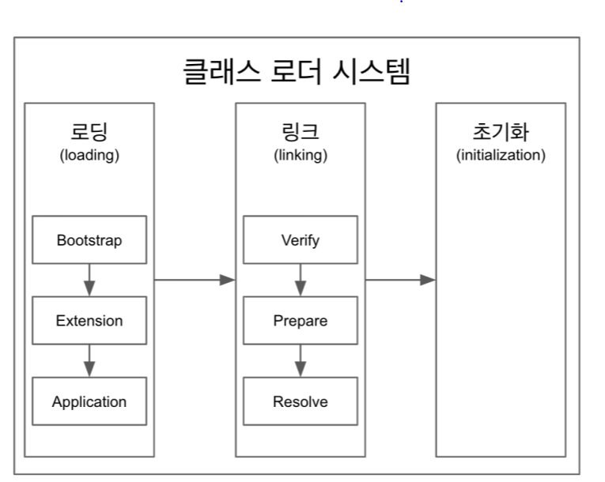

# 용어 설명

## JVM
- 자바 바이트 코드를 OS에 맞게 변환
    ```java
  // 자바 코드
    public class main{
      public static void main(String args[]){
        System.out.println("Hello World");
      }
    }
    ```
    `javac main.java`
    ```java
  // .class 코드
    public class main {
      public main() {
      }

      public static void main(String[] var0) {
        System.out.println("Hello World");
      }
    }
    ```
    `javap -c main`
    ```text
  // 바이트 코드
    public class main {
      public main();
        Code:
           0: aload_0
           1: invokespecial #1                  // Method java/lang/Object."<init>":()V
           4: return

      public static void main(java.lang.String[]);
        Code:
           0: getstatic     #7                  // Field java/lang/System.out:Ljava/io/PrintStream;
           3: ldc           #13                 // String Hello World
           5: invokevirtual #15                 // Method java/io/PrintStream.println:(Ljava/lang/String;)V
           8: return
    }

    ```
  
  - 위 코드를 통해 나온 바이트코드를 인터프리터 + JIT 를 통해 OS 에 맞는 코드로 변환되어 실행한다.
- OS에 종속적
- 밴더 (오라클, 아마존 ... ) 에 따라 구현방식이 다를 수도 있음
    - 하지만 스팩은 정해져있음

## JRE
- 자바 Application 을 실행하기 위해 구성된 배포판
- 개발 도구는 포함되지 않는다.
- 11 부터는 JRE를 따로 제공하지 않는다.

## JDK
- JRE + 개발 툴
- 오라클 + 11 version 이상 + 상용은 유료
    - 나머지는 무료
    
# JVM 의 구조



## 클래스 로더
- .class 를 읽음
- static 한 값을 초기화 & 읽음

##  메모리
- 메모리 영역
    - 클래스 수준의 정보 (클래스 이름, 부모 클래스 이름, 메소드, 변수..)가 저장된다.
- 힙 영역
    - 객체를 저장 및 관리
- 스택
    - 런타임 마다 런타임 스택을 만들고 그 안에 스택 프레임을 만듬
    - 쓰레드에 종속적
- PC
    - Program Counter register
    - 쓰레드 내 현재 실행할 스택 프레임을 가리키는 포인터
    - 쓰레드에 종속
- 네이티브 메소드 스택
    - JNI를 실행하는 스택

## JNI, 네이티브 메소드 라이브러리
- Java Native Interface
- 네이티브 메소드 라이브러리에는 C 같은 Low Level 언어로 작성된 코드가 들어있고 JNI를 통해 사용된다
    - ex. `Thread.CurrentThread();`

## 인터프리터
- 바이트 코드를 한줄씩 실행

## JIT 컴파일러
- 인터프리터를 사용할때 반복되는 코드를 발견하면 JIT 컴파일러로 네이티브 코드로 바꾸고 이후에는 컴파일된 코드를 사용

## GC
- Garbage Collector


# 클래스 로더 시스템



- 로딩,링크,초기화의 순서를 따릅니다.

## 로딩
- 클래스 로더가 .class 파일을 읽고 그 내용에 따라 적절한 바이너리 데이터를 만들고 "메소드" 영역에 저장
    - 이때 저장하는 데이터
        - FQCN
        - 클래스, 인터페이스,enum
        - 메소드와 변수
    - 로딩이 끝나면 해당 클래스 다입의 Class 객체를 생성하여 "힙"영역에 
```java
public class App {
    public static void main(String[] arges){
        ClassLoader classLoader = App.class.getClassLoader();
        System.out.println(classLoader); // AppClassLoader
        System.out.println(classLoader.getParent()); // PlatformClassLoader
        System.out.println(classLoader.getParent().getParent()); // null (Bootstrap Loader 인데 네이티브 코드라 볼 수 없음)
    }
}
```

## 링크
    - Verify -> Prepare -> Resolve
        - Verify
            - .class 를 검사
        - Prepare
            - 클래스 변수와 기본값에 필요한 메모리
        - Resolve
            - 심볼릭 메모리 레퍼런스를 메소드 영역에 있는 실제 레퍼런스로 교체
            
           
